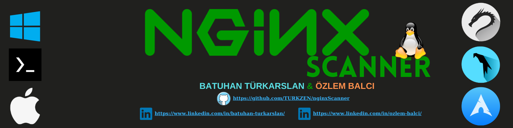

<h2 align="center"><u>nginxScanner</u></h2>

 
    
    
    
    
    

### [+] Description
The nginx scanner detects the current nginx version on the web server and detects the versions CVE

### [+] Installation
 - `git clone https://github.com/TURKZEN/nginxScanner`
 - `cd nginxScanner`
 - `chmod +x install.sh`
  - `./install.sh`

### [+] Usage
`nginxScanner <IP> or <URL> `

### [+] Credits 
 TURKZEN & OzlemBalci
 

### [+] Find me on 

